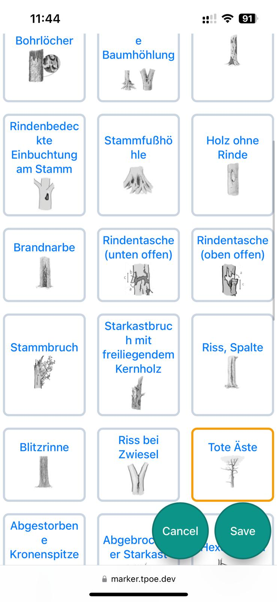
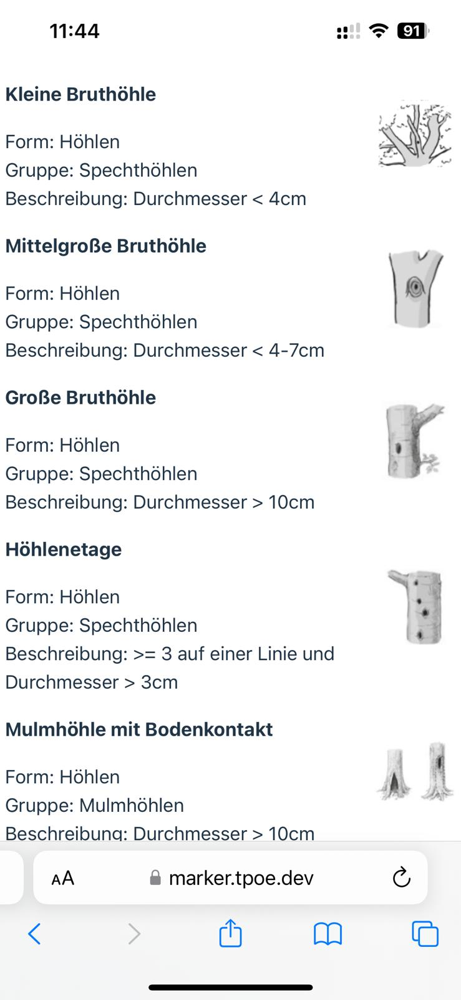
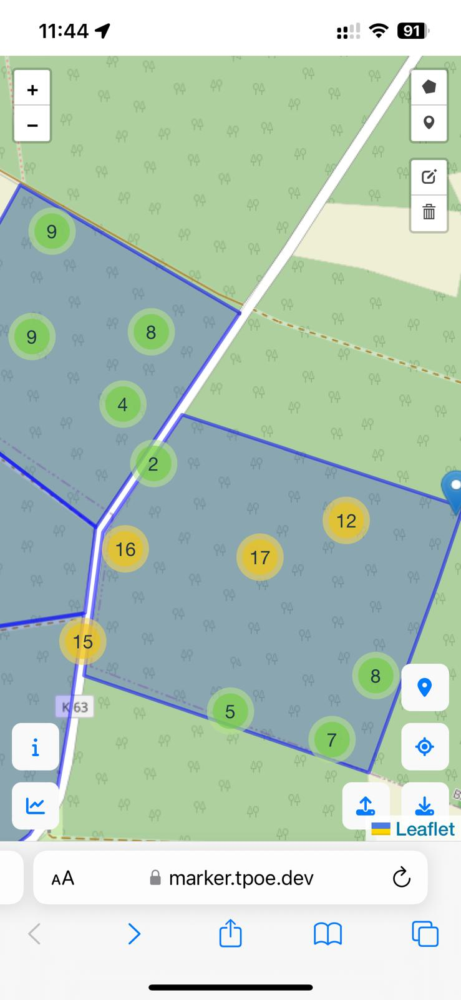
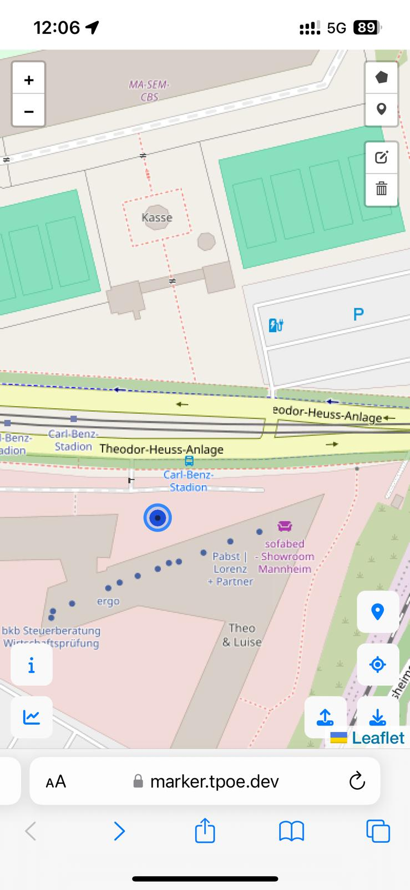
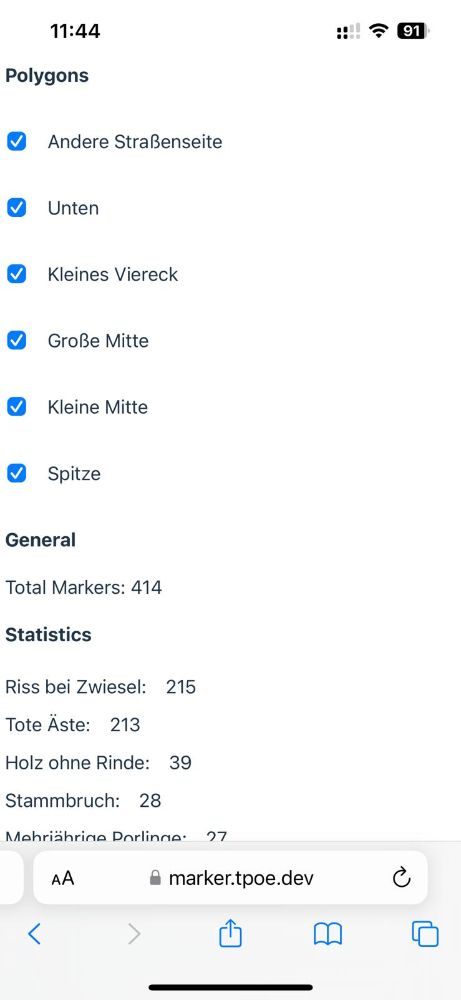

# Marker

Web application to find, classify and mark tree-related microhabitats for the [Förderprogramm klimaangepasstes Waldmanagement](https://www.bmel.de/DE/themen/wald/klimaangepasstes-waldmanagement.html) by using the geolocation api.

## Description

|                                     |                             |                           |                                     |                                         |
| ----------------------------------- | --------------------------- | ------------------------- | ----------------------------------- | --------------------------------------- |
|  |  |  |  |  |

## Usage

The application can be used under the following domain https://marker.tpoe.dev or self-hosted with Docker. The application stores all information locally on your device, so no data is sent to the server. The data can be easily exported and imported in the main view.

## Resources:

- https://www.bmel.de/DE/themen/wald/klimaangepasstes-waldmanagement.html
- https://www.klimaanpassung-wald.de/
- https://www.waldwissen.net/de/lebensraum-wald/naturschutz/habitatbaeume-kennen-schuetzen-und-foerdern

## Development

### Migration

This is probably not needed by anyone, as the first official release already uses version 3 of the data format.

```bash
npx tsx migrate.ts
```
