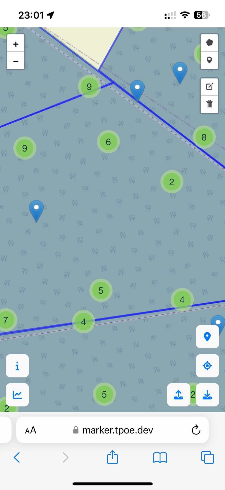

# Marker

Web application to find, classify and mark tree-related microhabitats for the [Förderprogramm klimaangepasstes Waldmanagement](https://www.bmel.de/DE/themen/wald/klimaangepasstes-waldmanagement.html) by using the geolocation api.

## Description

| Classify                            | Info                        | Map                       | Current position                    | Statistics                              |
| ----------------------------------- | --------------------------- | ------------------------- | ----------------------------------- | --------------------------------------- |
|  |  |  |  |  |

## Usage

The application can be accessed at https://marker.tpoe.dev or self-hosted with docker. All information is stored locally on your device, ensuring no data is sent to the server. Data can be easily exported and imported from the map view.

## Resources:

- https://www.bmel.de/DE/themen/wald/klimaangepasstes-waldmanagement.html
- https://www.klimaanpassung-wald.de/
- https://www.waldwissen.net/de/lebensraum-wald/naturschutz/habitatbaeume-kennen-schuetzen-und-foerdern

## Development

### Migration

This is probably not needed by anyone, as the first official release already uses version 3 of the data format.

```bash
npx tsx migrate.ts
```
